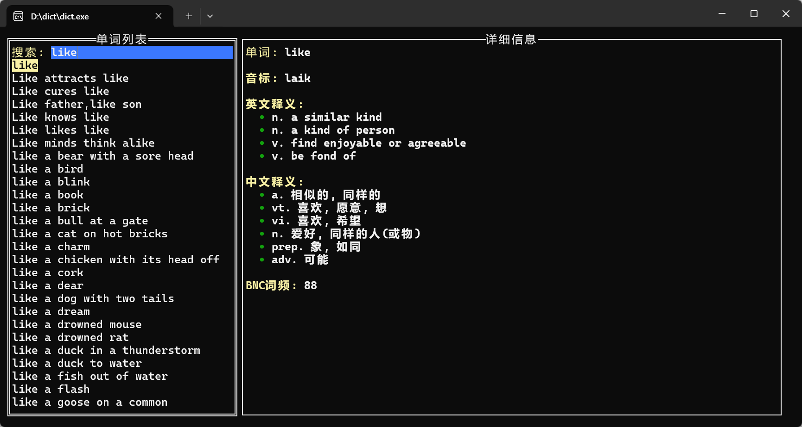
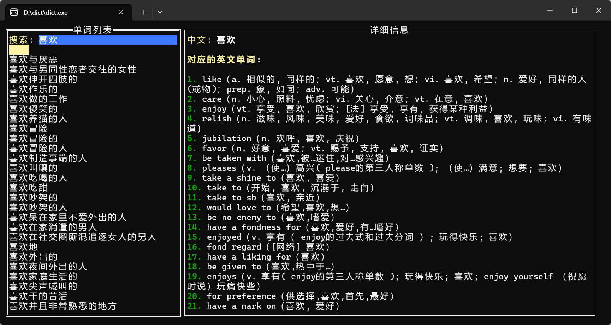

# 中英文词典 (Chinese-English Dictionary)

这是一个使用 Go 语言和 tview 开发的中英文词典应用程序。

## 功能特点

- ✅ 英文到中文翻译
- ✅ 中文到英文翻译
- ✅ 实时搜索与智能匹配
- ✅ 自动显示第一个匹配结果
- ✅ 5秒后自动切换到列表浏览
- ✅ 搜索历史记录（最多20条）
- ✅ 随机单词推荐
- ✅ 详细的单词信息显示（音标、释义等）
- ✅ 基于 SQLite 的本地数据库
- ✅ 跨平台支持（Windows、Linux、macOS）
- ✅ 终端界面（TUI）- 无需GUI环境
- ✅ 完善的键盘导航
- ✅ 首次运行自动初始化数据库

## 使用说明

下载 [Release](https://github.com/huzhenyuan/dict/releases) 里面的对应操作系统的压缩包，解压后双击 `dict` 即可运行。

**首次运行说明：**
- 程序会自动检测数据库文件是否存在
- 如果不存在，会自动解压 `ecdict.csv.gz` 并生成数据库（需要1-2分钟）
- 后续运行会直接加载数据库，启动速度很快（<1秒）




## 项目结构

```
dict/
├── main.go              # 主程序（包含TUI界面和自动初始化逻辑）
├── converter.go         # 数据库转换模块（被main.go调用）
├── ecdict.csv.gz        # ECDICT词典数据压缩包
├── go.mod              # Go 模块依赖
├── go.sum              # 依赖校验
├── english_chinese.db  # 英文-中文数据库（首次运行后自动生成）
├── chinese_english.db  # 中文-英文数据库（首次运行后自动生成）
└── README.md           # 说明文档
```

## 前置条件

### 普通用户（使用已编译版本）

1. **下载对应系统的压缩包**，解压即可
2. **终端支持**（支持彩色显示的终端）
3. **ecdict.csv.gz 文件**（已包含在发布包中）

### 开发者（从源码编译）

1. **Go 1.18 或更高版本**
2. **终端支持**（支持彩色显示的终端）
3. **ecdict.csv.gz 文件**

### 系统要求

- **Linux/macOS**: 自带终端即可
- **Windows**: 建议使用 Windows Terminal、PowerShell 或 Git Bash
- 不需要GUI环境，可以在SSH远程连接中使用

## 快速开始

### 方式一：使用预编译版本（推荐）

1. **下载发布包**
   - 访问 [Releases](https://github.com/huzhenyuan/dict/releases)
   - 下载对应系统的压缩包（包含 `dict` 可执行文件和 `ecdict.csv.gz`）

2. **解压并运行**
   ```bash
   # Linux/macOS
   tar -xzf dict-linux-amd64.tar.gz
   cd dict
   ./dict
   
   # Windows（使用 PowerShell）
   Expand-Archive dict-windows-amd64.zip
   cd dict
   .\dict.exe
   ```

3. **首次运行**
   - 程序会自动解压 `ecdict.csv.gz`
   - 自动生成 `english_chinese.db` 和 `chinese_english.db`
   - 整个过程需要 1-2 分钟，请耐心等待

4. **后续使用**
   - 直接运行 `./dict`，秒开！

### 方式二：从源码编译

#### 第一步：克隆项目或准备文件

确保你有以下文件：
- `main.go`
- `converter.go`
- `go.mod`
- `ecdict.csv.gz`（ECDICT词典数据压缩包）

#### 第二步：安装依赖

```bash
go mod tidy
```

#### 第三步：运行程序

```bash
# 直接运行（首次会自动初始化数据库）
go run main.go

# 或者编译后运行
go build -o dict main.go
./dict
```

**Windows 用户：**
```bash
go build -o dict.exe main.go
dict.exe
```

**首次运行流程：**
1. 检查数据库文件是否存在
2. 如不存在，自动解压 `ecdict.csv.gz` → `ecdict.csv`
3. 自动调用转换模块生成两个数据库文件
4. 加载数据库，启动应用

**后续运行：**
- 直接加载已有数据库，快速启动

## 编译说明

### Linux 编译

```bash
# 编译主程序
go build -o dict main.go

# 运行
./dict
```

### Windows 编译

**方法一：使用 PowerShell 或 CMD**
```powershell
# 编译主程序
go build -o dict.exe main.go

# 运行
.\dict.exe
```

**方法二：使用 Git Bash**
```bash
go build -o dict.exe main.go
./dict.exe
```

### macOS 编译

```bash
# 编译主程序
go build -o dict main.go

# 运行
./dict
```

### 交叉编译

如果需要在一个平台编译其他平台的可执行文件：

```bash
# 在 Linux/macOS 上编译 Windows 版本
GOOS=windows GOARCH=amd64 go build -o dict.exe main.go

# 在 Windows 上编译 Linux 版本（PowerShell）
$env:GOOS="linux"; $env:GOARCH="amd64"; go build -o dict main.go

# 在任意平台编译 macOS 版本
GOOS=darwin GOARCH=amd64 go build -o dict main.go
```

### 打包发布

```bash
# 创建发布包（包含可执行文件和数据文件）
mkdir dict-release
cp dict dict-release/          # 或 dict.exe
cp ecdict.csv.gz dict-release/
cp README.md dict-release/

# 压缩
tar -czf dict-linux-amd64.tar.gz dict-release/  # Linux/macOS
# 或使用 zip
zip -r dict-windows-amd64.zip dict-release/     # Windows
```

## 使用说明

### 界面布局

```
┌─────────────────────────────────────────────────────────────┐
│ 搜索: [输入中文或英文...]                                     │
├──────────────────────┬──────────────────────────────────────┤
│ ┌─ 单词列表 ────────┐│ ┌─ 详细信息 ──────────────────────┐ │
│ │                    ││ │                                  │ │
│ │ like               ││ │ 单词: like                       │ │
│ │ love               ││ │ 音标: /laɪk/                    │ │
│ │ library            ││ │                                  │ │
│ │ ...                ││ │ 英文释义:                        │ │
│ │                    ││ │   • similar to                  │ │
│ │                    ││ │                                  │ │
│ │                    ││ │ 中文释义:                        │ │
│ │                    ││ │   • 喜欢                         │ │
│ │                    ││ │   • 像                           │ │
│ └────────────────────┘│ │                                  │ │
│                        │ │ BNC词频: 25                      │ │
│                        │ └──────────────────────────────────┘ │
└────────────────────────┴──────────────────────────────────────┘
```

### 操作指南

#### 基本操作

1. **搜索单词**
   - 直接在搜索框输入英文或中文
   - 系统会实时显示匹配的单词列表
   - 第一个匹配的单词会自动显示详情

2. **浏览列表**
   - 按 `↑` `↓` 方向键在列表中上下移动
   - 无论焦点在哪里，按方向键都会自动切换到单词列表
   - 移动时右侧会实时显示当前单词的详情

3. **点击查看**
   - 鼠标点击列表中的单词可以查看详情
   - 点击的单词会被添加到搜索历史

#### 快捷键

| 按键 | 功能 |
|------|------|
| `字母/数字` | 在任何位置按字母，会自动跳转到搜索框并清空 |
| `↑` `↓` | 在任何位置按上下键，会自动跳转到单词列表 |
| `Enter` | 在搜索框按Enter，跳转到单词列表 |
| `Tab` | 在搜索框、单词列表、详情面板间循环切换 |
| `Esc` | 退出程序 |
| `鼠标点击` | 可以点击单词列表项或滚动查看详情 |

#### 智能功能

1. **自动选择**
   - 输入搜索词后，第一个匹配结果会自动选中并显示详情
   - 5秒后自动将焦点切换到单词列表，方便浏览

2. **搜索历史**
   - 搜索框为空时，显示最近查询的20个单词
   - 历史记录会标注 `[灰色]历史:` 前缀
   - 只有以下操作会添加到历史：
     - 输入搜索词后等待5秒
     - 鼠标点击列表中的单词

3. **随机推荐**
   - 首次启动或清空历史后，会显示20个高频英文单词
   - 这些单词来自BNC语料库（词频0-1000）

4. **智能排序**
   - 搜索结果按匹配度排序：
     1. 完全匹配
     2. 前缀匹配
     3. 包含匹配
   - 最多显示100个结果

## 常见问题

### 1. 首次运行时间较长

**问题**：第一次运行程序需要等待1-2分钟

**说明**：这是正常的，因为程序需要：
1. 解压 `ecdict.csv.gz`（约30秒）
2. 生成两个数据库文件（约1-2分钟）

**解决**：
- 请耐心等待，只需要一次
- 后续运行会直接加载数据库，秒开

### 2. 找不到 ecdict.csv.gz 文件

**问题**：运行时提示 "找不到 ecdict.csv.gz 文件"

**解决**：
```bash
# 确保 ecdict.csv.gz 与可执行文件在同一目录
ls -la
# 应该看到：
# dict (或 dict.exe)
# ecdict.csv.gz
```

### 3. 中文显示乱码

**问题**：终端中中文显示为方框或乱码

**解决**：
```bash
# Linux/macOS
export LANG=en_US.UTF-8

# Windows：在终端设置中选择 UTF-8 编码
# 或使用 Windows Terminal（自动支持UTF-8）
```

### 4. 终端不显示颜色

**问题**：没有彩色显示

**解决**：使用现代终端
- **Linux**: GNOME Terminal, Konsole, Alacritty
- **macOS**: iTerm2, Terminal.app
- **Windows**: Windows Terminal（推荐）

## 贡献

欢迎提交 Issue 和 Pull Request！

---

**享受查词的乐趣！ 📖**
